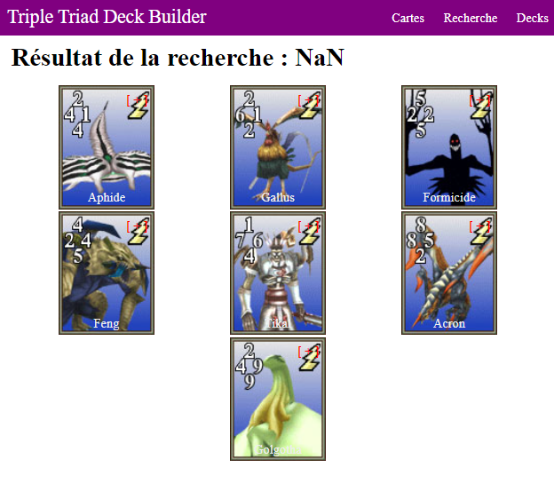
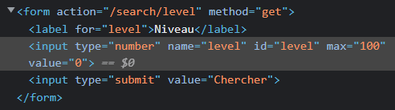

# Feedback 1

## Points forts :clap:

-   Les vues sont regroupés par dossier
-   Bonne gestion de la recherche quand on choisit "aucun élément"
-   Utilisation de dotenv pour la clé secrète
-   Les codes de statut de réponse HTTP sont bien utilisés
-   Utilisation d'un middleware
-   Affichage d'un message quand il n'y a pas de cartes dans le deck
-   Partie bonus du parcours complétée
-   Code bien identé et commenté

## Erreurs identifiées :boom:

### Étape 1 : Détail d'une carte

-   Rajouter des libellés en français pour afficher les informations d'une carte

### Étape 2 : Recherche

-   Dans `dataMapper.js`, La fonction `searchByElementNull()` a été déclarée mais n'est jamais utilisée

```
searchByElementNull: async() => {
    const result = await database.query(query);
    return result.rows;
}
```

-   Sur la page de recherche par élément, le titre du résultat de la recherche contient **"NaN"** (Cf image ci-dessous).



```
res.render('main/cardList', {
    cards: searchedResults,
    title: 'Résultat de la recherche : ' +
      (searchedElement === 'null' ? ' sans élément' : +searchedElement),
});
```

> Le "+" devant `searchedElement` le transforme en un nombre. Si `searchedElement` est une chaîne vide ou "null", cela se traduira par NaN (Not a Number), d'où le résultat obtenu. Pour corriger cela, il faut supprimer le "+" devant `+searchedElement`

## Pour aller plus loin :fire:

-   Plus utiliser les **conditions ternaires** au lieu des **if else** dans `card-item.ejs` par exemple. (Cf https://developer.mozilla.org/fr/docs/Web/JavaScript/Reference/Operators/Conditional_operator)

```
    <p>Element:
      <% if(card.element){ %>
        <%= card.element %>
      <% } else { %>
        empty
      <% } %>
    </p>
```

-   Valider les entrées des formulaires et vérifier les valeurs côté serveur car l'utilisateur peut inspecter le code client et enlever les contraintes html max et min pour créer des failles **_(NEVER TRUST USER)_**



-   Ajouter [+] ou [-] sur les autres pages ou les cartes s'affichent pour les ajouter et les supprimer du deck

-   Gérer les valeurs des paramètres des requêtes quand l'utilisateur essaie de les modifier manuellement dans l'url pour faire bugger l'application
