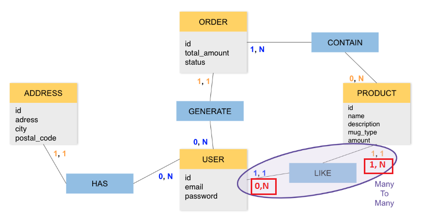

# Retour sur un MCD d'un.e apprenant.e

## Corrections :boom:

Tu as fait du bon travail, mais il y a des petites corrections au niveau de la liaison entre l'entité `USER` et l'entité `PRODUCT`. Il faudrait revoir les cardinalités. Elles doivent suivre les règles suivantes :

-   Un utilisateur peut liker 1 ou plusieurs produits : un utilisateur créée peut ne pas liker de produit au début. Ce qui donne comme cardinalité au niveau de `USER` **(0, N)**
-   Un produit est liké par au moins 1 ou plusieurs utilisateurs. Ce qui donne comme cardinalité au niveau de `PRODUCT` **(1, N)**

Voir la correction sur l'image ci-dessous :

J'espère que cela t'aidera :sunglasses:. N'hésite pas à me faire un retour s'il y a des zones d'ombre :wink:.

J'aimerais te présenter aussi quelques outils qui pourront t'aider à réaliser des MCD.

## Quelques outils de conception des MCD :triangular_ruler:

-   **GitMind** : GitMind réfléchit à la fois à l'esthétique et à la cinématique, améliorant continuellement les entrées et les sorties, sortant des sentiers battus avec des cartes mentales, des organigrammes, des diagrammes et des couloirs pour s'épanouir de manière ordonnée, lisse, soyeuse et belle (https://gitmind.com/fr/)
-   **Draw.io** : Logiciel de dessin graphique multiplateforme gratuit et open source développé en HTML5 et JavaScript. Son interface peut être utilisée pour créer des diagrammes tels que des organigrammes, des structures filaires, des diagrammes UML, des organigrammes et des diagrammes de réseau (https://app.diagrams.net/)
-   **PowerDesigner** : Logiciel de conception créé par la société SAP, qui permet de modéliser les traitements informatiques et leurs bases de données associées (https://www.powerdesigner.biz/FR/)
-   **DBDesigner** : Logiciel de conception de base de données sous forme graphique qui intègre tous les niveaux de conception, de modification, de création et de maintenance sur la structure d'une base de données (https://www.dbdesigner.net/)
